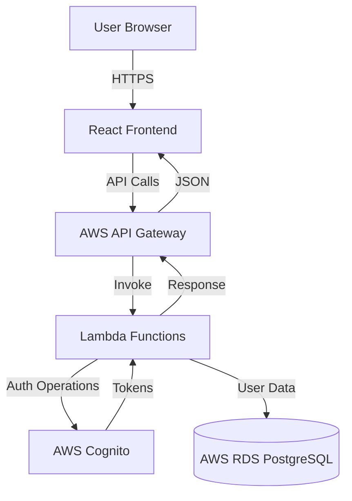

# Design Document

## Overview

This application demonstrates authentication and authorization using AWS Cognito in a serverless architecture. The system consists of three main layers:

1. **Frontend Layer**: A React application built with TypeScript that provides user interfaces for registration, login, and a homepage
2. **API Layer**: AWS API Gateway routing requests to Lambda functions
3. **Data Layer**: AWS Cognito for authentication and AWS RDS PostgreSQL for user data persistence

The architecture follows a monorepo structure with clear separation between frontend and backend (Lambda) code, all written in TypeScript with strict typing enabled.

## Architecture

### High-Level Architecture



### Monorepo Structure

```
/
├── frontend/                 # React application
│   ├── src/
│   │   ├── components/      # React components
│   │   ├── pages/           # Page components
│   │   ├── services/        # API service layer
│   │   ├── types/           # TypeScript type definitions
│   │   └── App.tsx
│   ├── package.json
│   └── tsconfig.json
├── backend/                  # Lambda functions
│   ├── src/
│   │   ├── handlers/        # Lambda function handlers
│   │   ├── services/        # Business logic services
│   │   ├── db/              # Database utilities
│   │   ├── types/           # TypeScript type definitions
│   │   └── utils/           # Shared utilities
│   ├── package.json
│   └── tsconfig.json
├── infrastructure/           # AWS infrastructure code
│   └── db-migrations/       # Database migration scripts
└── package.json             # Root package.json for monorepo
```

## Components and Interfaces

### Frontend Components

#### 1. HomePage Component
- **Purpose**: Landing page displaying navigation and user status
- **Props**: None (uses auth context)
- **State**: User authentication status
- **Behavior**:
  - Shows login/register links when user is not authenticated
  - Shows user information when authenticated
  - Provides navigation to other pages

#### 2. LoginPage Component
- **Purpose**: User login interface
- **Props**: None
- **State**: 
  - `username: string`
  - `password: string`
  - `error: string | null`
  - `loading: boolean`
- **Behavior**:
  - Validates input fields
  - Calls authentication service
  - Stores tokens on success
  - Displays error messages on failure
  - Redirects to homepage on success

#### 3. RegisterPage Component
- **Purpose**: User registration interface
- **Props**: None
- **State**:
  - `username: string`
  - `email: string`
  - `password: string`
  - `confirmPassword: string`
  - `error: string | null`
  - `loading: boolean`
- **Behavior**:
  - Validates input fields (email format, password strength, password match)
  - Calls registration service
  - Redirects to login page on success
  - Displays error messages on failure

#### 4. AuthService
- **Purpose**: Handles all authentication-related API calls
- **Methods**:
  - `register(username: string, email: string, password: string): Promise<void>`
  - `login(username: string, password: string): Promise<AuthTokens>`
  - `logout(): void`
  - `getStoredTokens(): AuthTokens | null`
  - `storeTokens(tokens: AuthTokens): void`

### Backend Components

#### 1. Register Handler (Lambda)
- **Purpose**: Handle user registration requests
- **Input**: 
  ```typescript
  interface RegisterRequest {
    username: string;
    email: string;
    password: string;
  }
  ```
- **Output**:
  ```typescript
  interface RegisterResponse {
    success: boolean;
    message: string;
  }
  ```
- **Flow**:
  1. Validate input data
  2. Create user in Cognito
  3. Store user data in RDS using DatabaseService
  4. Return success response
- **RDS Access**: Creates new user record in users table

#### 2. Login Handler (Lambda)
- **Purpose**: Handle user login requests
- **Input**:
  ```typescript
  interface LoginRequest {
    username: string;
    password: string;
  }
  ```
- **Output**:
  ```typescript
  interface LoginResponse {
    accessToken: string;
    idToken: string;
    refreshToken: string;
    expiresIn: number;
  }
  ```
- **Flow**:
  1. Validate input data
  2. Authenticate with Cognito
  3. Return authentication tokens
- **RDS Access**: None (authentication only)

#### 3. GetUserInfo Handler (Lambda)
- **Purpose**: Retrieve user information from database
- **Input**: 
  ```typescript
  interface GetUserInfoRequest {
    // Cognito ID extracted from JWT token in Authorization header
  }
  ```
- **Output**:
  ```typescript
  interface GetUserInfoResponse {
    user: User;
  }
  ```
- **Flow**:
  1. Verify JWT token from Authorization header
  2. Extract Cognito ID from token
  3. Query RDS for user data using DatabaseService
  4. Return user information
- **RDS Access**: Reads user data from users table

#### 4. CognitoService
- **Purpose**: Encapsulate AWS Cognito operations
- **Methods**:
  - `signUp(username: string, email: string, password: string): Promise<CognitoUser>`
  - `signIn(username: string, password: string): Promise<AuthTokens>`
  - `verifyToken(token: string): Promise<TokenPayload>`

#### 4. DatabaseService
- **Purpose**: Handle database operations
- **Methods**:
  - `createUser(cognitoId: string, username: string, email: string): Promise<User>`
  - `getUserByCognitoId(cognitoId: string): Promise<User | null>`
  - `getConnection(): Promise<Pool>`
  - `getDbCredentials(): Promise<DbCredentials>` - Retrieves credentials from AWS Secrets Manager

#### 5. SecretsService
- **Purpose**: Retrieve secrets from AWS Secrets Manager
- **Methods**:
  - `getSecret(secretName: string): Promise<string>`
  - `getDbCredentials(): Promise<DbCredentials>` - Parses and returns database credentials

## Data Models

### User Table (PostgreSQL)

```sql
CREATE TABLE users (
  id SERIAL PRIMARY KEY,
  cognito_id VARCHAR(255) UNIQUE NOT NULL,
  username VARCHAR(100) UNIQUE NOT NULL,
  email VARCHAR(255) UNIQUE NOT NULL,
  created_at TIMESTAMP DEFAULT CURRENT_TIMESTAMP,
  updated_at TIMESTAMP DEFAULT CURRENT_TIMESTAMP
);

CREATE INDEX idx_cognito_id ON users(cognito_id);
CREATE INDEX idx_username ON users(username);
CREATE INDEX idx_email ON users(email);
```

### TypeScript Interfaces

```typescript
// Shared types
interface User {
  id: number;
  cognitoId: string;
  username: string;
  email: string;
  createdAt: Date;
  updatedAt: Date;
}

interface AuthTokens {
  accessToken: string;
  idToken: string;
  refreshToken: string;
  expiresIn: number;
}

interface ApiResponse<T> {
  success: boolean;
  data?: T;
  error?: string;
}

interface DbCredentials {
  host: string;
  port: number;
  dbname: string;
  username: string;
  password: string;
}

// Lambda event types
interface APIGatewayProxyEventWithBody<T> extends Omit<APIGatewayProxyEvent, 'body'> {
  body: T;
}
```

## Error Handling

### Frontend Error Handling
- **Network Errors**: Display user-friendly message "Unable to connect to server"
- **Validation Errors**: Display field-specific error messages
- **Authentication Errors**: Display "Invalid username or password"
- **Registration Errors**: Display specific error (e.g., "Username already exists")

### Backend Error Handling
- **Lambda Error Response Format**:
  ```typescript
  interface ErrorResponse {
    statusCode: number;
    body: string; // JSON stringified { success: false, error: string }
  }
  ```
- **Error Categories**:
  - 400: Bad Request (validation errors)
  - 401: Unauthorized (authentication failures)
  - 409: Conflict (duplicate username/email)
  - 500: Internal Server Error (unexpected errors)

### Database Error Handling
- Connection errors: Retry logic with exponential backoff
- Constraint violations: Return specific error messages
- Transaction failures: Rollback and return error

### Cognito Error Handling
- Map Cognito error codes to user-friendly messages:
  - `UsernameExistsException` → "Username already exists"
  - `InvalidPasswordException` → "Password does not meet requirements"
  - `NotAuthorizedException` → "Invalid username or password"
  - `UserNotFoundException` → "Invalid username or password"

## Testing Strategy

### Frontend Testing
- **Unit Tests**: Test individual components with React Testing Library
  - Form validation logic
  - API service methods
  - Token storage/retrieval
- **Integration Tests**: Test component interactions
  - Login flow
  - Registration flow
  - Navigation between pages

### Backend Testing
- **Unit Tests**: Test individual functions
  - CognitoService methods (mocked AWS SDK)
  - DatabaseService methods (mocked database)
  - Input validation functions
- **Integration Tests**: Test Lambda handlers
  - End-to-end registration flow
  - End-to-end login flow
  - Database operations with test database

### Manual Testing
- Test complete user flows in deployed environment
- Verify Cognito user pool integration
- Verify RDS database persistence
- Test error scenarios

## Security Considerations

1. **Password Requirements**: Enforce minimum 8 characters, uppercase, lowercase, number, special character
2. **Token Storage**: Store tokens in httpOnly cookies or secure localStorage
3. **HTTPS Only**: All API communication over HTTPS
4. **SQL Injection Prevention**: Use parameterized queries
5. **Secrets Management**: Store RDS credentials in AWS Secrets Manager (never in environment variables or code)
6. **IAM Permissions**: Follow principle of least privilege for Lambda execution roles
7. **CORS Configuration**: Restrict API Gateway CORS to frontend domain
8. **Input Validation**: Validate and sanitize all user inputs on both frontend and backend
9. **VPC Security**: Lambda functions access RDS through private VPC subnets with security groups
10. **Secret Rotation**: Enable automatic rotation for RDS credentials in Secrets Manager

## Deployment Configuration

### Environment Variables

**Frontend**:
- `REACT_APP_API_ENDPOINT`: API Gateway URL

**Backend Lambda**:
- `COGNITO_USER_POOL_ID`: Cognito User Pool ID
- `COGNITO_CLIENT_ID`: Cognito App Client ID
- `DB_SECRET_NAME`: AWS Secrets Manager secret name containing RDS credentials
- `AWS_REGION`: AWS region for Secrets Manager and other services

**AWS Secrets Manager Secret Structure** (JSON):
```json
{
  "host": "rds-endpoint.region.rds.amazonaws.com",
  "port": 5432,
  "dbname": "cognitodemo",
  "username": "dbuser",
  "password": "securepassword"
}
```

### AWS Resources Required
- AWS Cognito User Pool with App Client
- AWS RDS PostgreSQL instance
- AWS Secrets Manager secret containing RDS credentials
- AWS API Gateway REST API
- AWS Lambda functions (3: register, login, getUserInfo)
- IAM roles for Lambda execution with appropriate permissions:
  - Cognito access (cognito-idp:*)
  - Secrets Manager access (secretsmanager:GetSecretValue)
  - RDS access (network access via VPC configuration)
  - CloudWatch Logs (logs:CreateLogGroup, logs:CreateLogStream, logs:PutLogEvents)
- VPC configuration for Lambda functions to access RDS